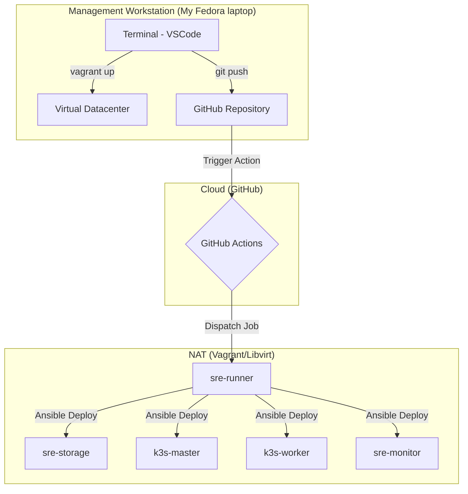

# Pokedex SRE Platform

A cloud-native infrastructure sandbox designed to demonstrate **Site Reliability Engineering (SRE)** principles. This platform implements a fully automated, observable, and resilient environment using **K3s** for orchestration and **GitHub Actions** for continuous delivery.
> **Technical Vision:** This platform serves as a high-fidelity simulation of production-grade distributed systems, focusing on deep-storage reliability and automated incident response.
> **Note:** The "Pokedex" application acts as the target workload to validate infrastructure health, CI/CD pipelines, and observability alerting.

---

## Architectural Overview
The platform functions as a testbed for four core SRE pillars. We treat the application as a "black box" workload to validate the reliability of the underlying infrastructure.

### SRE Pillars (Project Roadmap)

| Pillar | Focus | Status |
| :--- | :--- | :--- |
| **0. Foundations** | GitOps, CI/CD, Self-Hosted Runners | ✅ STABLE |
| **1. High-Density Storage** | **ZFS Mirroring, Recordsize tuning (8k) & CI/CD integration.** | ✅ STABLE |
| **2. Observability** | Unified Telemetry via Grafana Alloy (OTel). | 🚧 In Progress |
| **3. IaC** | Idempotent infrastructure automation with Ansible. | 🚧 In Progress |
| **4. Kernel/Network** | TCP stack tuning and ephemeral port diagnostics. | 📋 Planning |
| **5. Persistence** | Connection multiplexing with PgBouncer. | 📋 Planning |

---

---
## Local Lab Setup 

This project uses **Vagrant + Libvirt** to create a high-fidelity virtual environment.

### Prerequisites
- **Hypervisor:** Libvirt (KVM/QEMU) installed and running.
- **Vagrant:** With the `vagrant-libvirt` plugin.
- **Host Networking:** The `Vagrantfile` includes automated triggers to configure **IP Forwarding** and **Iptables bypass**. This ensures connectivity even if Docker or K3s are running on the host.
- **SSH Key:** Automatically handled. The Vagrantfile generates `~/.ssh/id_rsa_ansible` if not found.

### Spin up the environment
```bash
# Deployed from the infrastructure directory
cd infrastructure/vagrant
vagrant up
```
 ### Virtual Machine Inventory 
| Node | IP (Static) | Role | Specs (vCPU/RAM) |
| :--- | :--- | :--- | :--- |
| **sre-runner** | `192.168.56.10` | GitHub Actions|GH Self-Hosted Runner | 1 vCPU / 2GiB |
| **sre-monitor** | `192.168.56.11` | Observability Stack | 2 vCPU / 4GiB |
| **sre-storage** | `192.168.56.12` | ZFS & MinIO Engine | 1 vCPU / 2GiB |
| **k3s-master** | `192.168.56.20` | K3s Control Plane | 2 vCPU / 4GiB |
| **k3s-worker** | `192.168.56.21` | K3s Worker Node | 2 vCPU / 4GiB |

> [!INFO]- Network Isolation
> This table defines static addressing within the `192.168.56.0/24` private network. It serves as the **Single Source of Truth** for the [[Ansible]] inventory and the [[Vagrantfile]] configuration.
---
## Identity & Security: 
>The entire fleet utilizes a high-entropy Ed25519 mesh. The sre-runner acts as the SSoT (Single Source of Truth) for configuration, ensuring zero manual drift.
---

## Design Philosophy: Enterprise-Grade Storage

This platform implements advanced operational patterns for high-density data environments:

* **Storage Engine (ZFS Integration):** Implementation of mirrored pools with a focus on data integrity. I apply **PostgreSQL-specific optimizations** (`recordsize=8k`) and customized **scrub scheduling** to balance data validation with I/O throughput, avoiding performance degradation during high-traffic windows.
* **Scalable Encryption:** Architecture designed for native encryption at the dataset level. The design follows a decoupled key management strategy to handle large-scale disk fleets without operational overhead.
> [!IMPORTANT]
> **Current Optimization Debt:** > - **Provisioning Time:** ~7 min due to DKMS kernel module compilation during `apt install`. 
> - **Future Mitigation:** Implement **Packer** for "Golden Image" baking and **APT-Cacher-NG** to reduce bandwidth and CPU overhead during node scale-up.
---
## Infrastructure Operations & CI/CD
We operate under a **GitOps** philosophy using **GitHub Actions** with **Self-Hosted Runners** to manage our hybrid cluster (K3s).

### CI/CD Pipeline Strategy 🚧
The project follows a **"Validate-First"** automation strategy:
* **CI (Quality Gates):** * `Ansible-lint`: Validates infrastructure-as-code best practices.
    * `Yamllint`: Ensures strict YAML syntax consistency.
    * `Trivy`: Automated security scanning for vulnerabilities.
* **CD (Deployment):** Automated via **GitHub Actions Self-Hosted Runners** located inside the private network. This ensures secure deployment without exposing the cluster to the public internet.
* **Smoke Tests:** Post-deployment validation verifies service availability (`HTTP 200 OK`) before marking a build as successful.

---

## Technical Stack

```yaml
orchestration:
  - K3s (Lightweight Kubernetes)

storage_layer:
  - ZFS (Optimized Data Pools)
  - Features: Native Encryption, zstd Compression, 8k Recordsize

automation:
  - Ansible (IaC)
  - GitHub Actions (CI/CD)

observability:
  - Grafana Alloy (Telemetry Pipeline)
  - VictoriaMetrics (Time Series)
  - Grafana (Visualization)

data_resilience:
  - PostgreSQL
  - PgBouncer (Connection Pooling)
  - MinIO (S3-compatible backups)
```
---
## Application Workload (Pokedex)

While the focus is infrastructure, the platform hosts a microservices-based application to generate real traffic and telemetry.
Architecture Traffic Flow

User → Frontend → Backend → [Redis Cache] → PokeAPI → 📊 PostgreSQL + Redis

    Intelligent Caching: Redis is utilized as the primary cache layer to ensure sub-100ms response times for the Pokémon API.

    Analytics: PostgreSQL serves as the persistent data layer, structured for high-cardinality metrics and Grafana dashboard integration.

Microservices Architecture

    Frontend: NGINX + Vanilla JS.

    Backend: FastAPI (Python) with async endpoints.

    Orchestration: K3s cluster.

## Storage & Persistence Strategy (MinIO)

We utilize MinIO as an AWS S3-compatible object storage solution, ensuring independence from cloud vendor lock-in.

    Purpose: Automated backup of PostgreSQL database dumps and persistent volumes.

    SRE Impact: Guaranteed data recovery and point-in-time restoration capabilities, managed via automated scripts.

---

## Operational Verification (Day-2 Operations) 🚧
*How to validate the system status without a UI.*
* **Verify Storage:** `vagrant ssh sre-storage -c "zfs list && zpool status"`
* **Verify Infrastructure:** `kubectl get pods -n pokedex-namespace`
* **Verify Telemetry:** [Link to Grafana Dashboard/Public view]
* **Verify Data Integrity:** `psql -c "SELECT count(*) FROM pokemons;"`

> **SRE Mindset:** Systems should be verifiable from the terminal. If you can't verify it with a CLI, it's not production-ready.

---

## Operational Insights & Post-Mortem 🚧
*We treat failures as telemetry data.*
### [Incident] Network Isolation and Forwarding Failure
- **Symptom:** 100% packet loss in VMs and Ansible provisioning timeout.
- **Root Cause:** Conflict between `net.bridge.bridge-nf-call-iptables` and host-side Kubernetes rules.
- **Resolution:** Implemented high-priority iptables bypass via Vagrant Triggers.
- **[Full Post-Mortem Report](./docs/post-mortems/2026-04-21-network-isolation.md)**

---
[Incident Case Study] Silent Data Corruption Recovery:

    Symptom: Checksum mismatch in database blocks.

    Action: Block isolation via zdb and point-in-time recovery from object storage.

    Full Report

[Incident] K3s DNS Resolution Failure: * Root Cause: CoreDNS misconfiguration in host-networking.

    Resolution: Adjusted ansible template to ensure atomic updates.

    Full Post-Mortem
